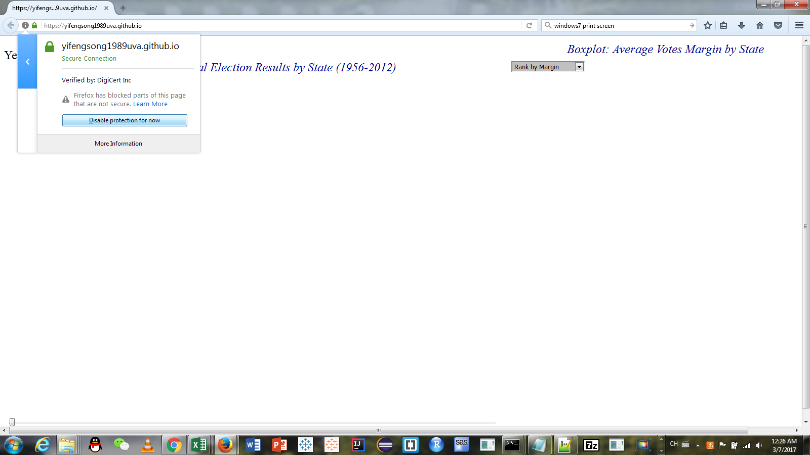
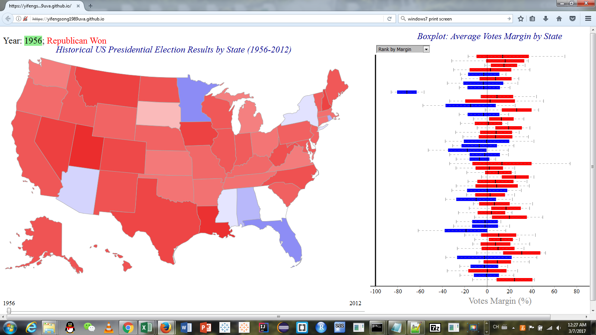

# Data_Visualization_Final_Project_Sp16

Link to the actual dynamic visualization:
https://yifengsong1989uva.github.io/

Use Firefox to open the link. It might be that the graphs are blocked by the browser:

Then you can disable protection for now:

After the protection is temporarily disabled, the visualization should be like this:

